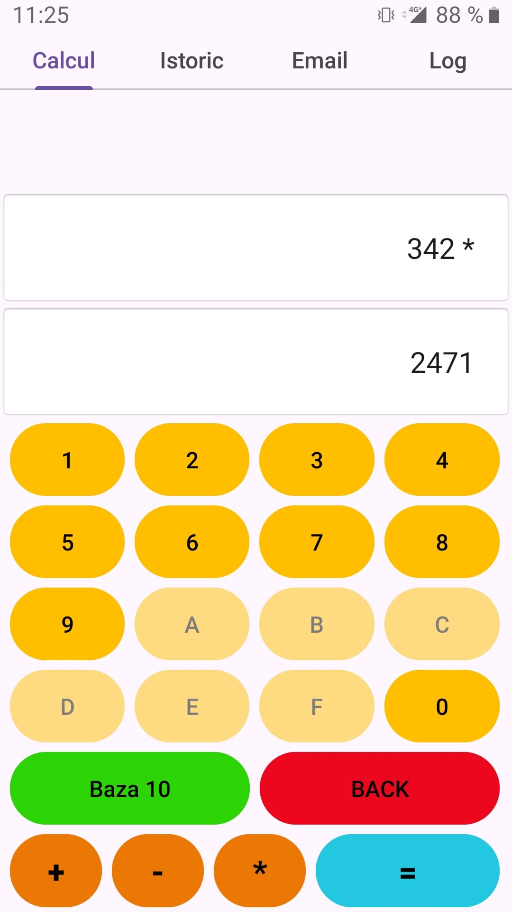
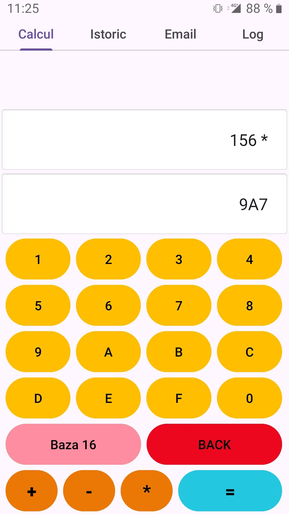
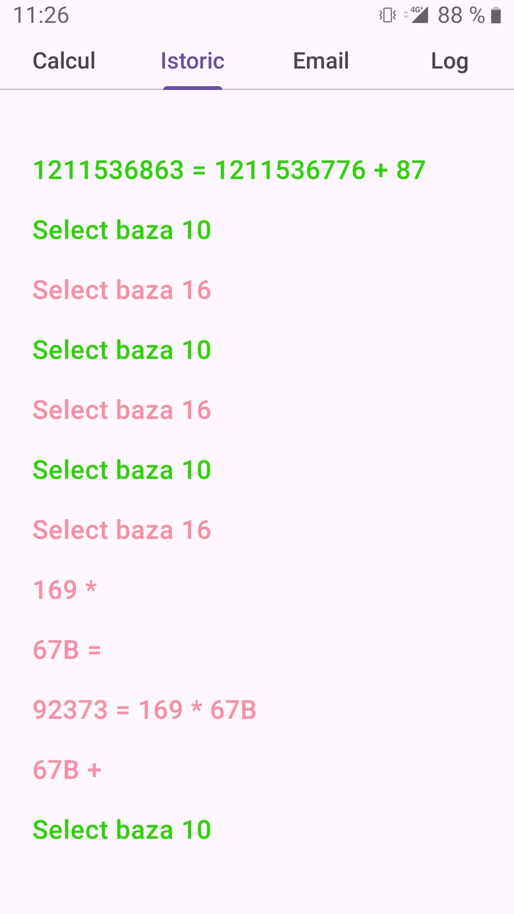
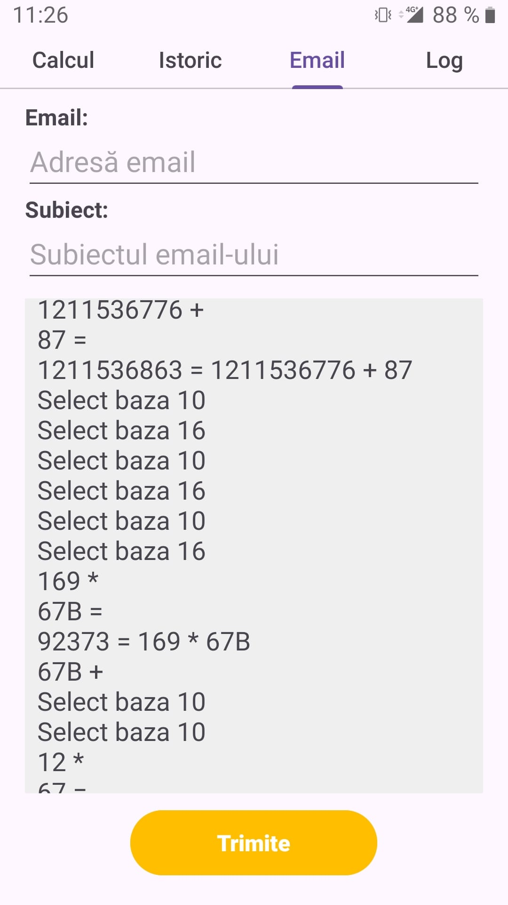
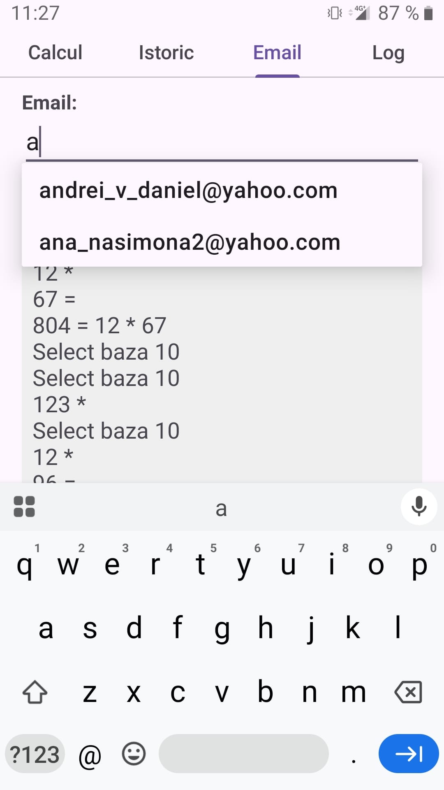
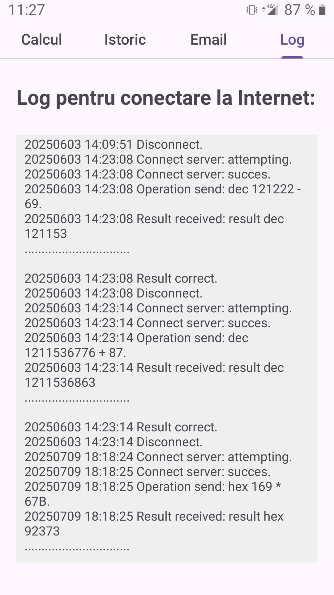

# 📱 Decimal / Hexadecimal Calculator

> **Android application developed in Kotlin** for the **Mobile Application Development** course – Faculty of Letters and Sciences, Informatics Specialization, UPG Ploiești.

This project implements a robust mobile solution featuring Fragments, SQLite persistence, HTTP communication, email integration, and a dedicated logging system.

---

## 🧮 Main Features

- **Decimal / Hexadecimal** Calculator.
- **Custom Virtual Keyboard** with digits '0-F'.
- **Mathematical Operations:**
    - ➕ Addition
    - ➖ Subtraction
    - ✖️ Multiplication
- **Automatic Conversion** between Base 10 and Base 16.
- **Selectable Calculation History**.
- **Email Integration** for exporting history.
- **Remote Server Communication** via HTTP/HTTPS.
- **Internet Connection Logs**.
- **Local Data Persistence** using SQLite.

---

## 🧩 Application Architecture
The application is modularized using **Fragments**, providing a smooth user experience:

| Fragment | Description |
|--------|------------|
| **Calcul** | Keyboard interface, math operations, and base conversion logic |
| **Istoric** | Calculation history management (ListView + SQLite) |
| **Email** | Feature for sending the calculation history via email |
| **Log** | Displaying the internet connection logs |

Navigation between screens is handled via **ViewPager2**.

---

## 🗄️ Database Structure (SQLite)

The application uses a local database to ensure data persistence across sessions.

### Implemented Tables

**calcul**
- `operatie`, `operand1`, `operand2`, `bazanumeratie`, `rezultat`, `dataora`

**istoric**
- `linie`, `culoare`

**emailuri**
- `adresa_email`

> 💡 **Note:** Upon startup, the history is automatically loaded from the database. To improve readability, entries are color-coded: **Base 10** values are displayed in **green**, while **Base 16** values appear in **pink**.

---

## 🌐 Server Communication

When the '=' button is pressed, the app sends an HTTPS request in the following format:
`user_numberBase_operand1_operator_operand2`

The result received from the server is displayed side-by-side with the locally calculated result for verification.

---

## 🧾 Logging System

The application tracks significant events to facilitate debugging and monitoring:

- Server connection (Success/Error)
- Message sent
- Response received
- Network errors
- Disconnection

**Log Specifications:**
- Saved as a text file in **Internal Storage**.
- Read and parsed during application startup.
- Displayed within the **Log** fragment.

---

## ✉️ Email Export

- The complete history can be shared via email.
- Implemented using **Explicit Intents**.
- Recipient email addresses are stored in the **emailuri** table.
- The email field provides **Auto-suggestions** based on previously used addresses.

---

## 🎨 User Interface & UX

- **Contextual UI:** Buttons 'A-F' are automatically disabled when in Base 10 mode.
- **Real-time Conversion:** Values convert automatically when switching between bases.
- **Visual Distinction:** 
    - Base 10 -> Green
    - Base 16 -> Pink
- **Smart Scrolling:** The history automatically scrolls to the most recent values.

---

## 📸 Screenshots

<table>
<tr>
  <td></td>
  <td></td>
  <td></td>
</tr>
<tr>
  <td></td>
  <td></td>
  <td></td>
</tr>
</table>

## 📄 Documentation

Full technical documentation regarding the implementation details can be found in the `docs` folder.

---

## 🛠️ Tech Stack

- **Language:** Kotlin
- **UI Components:** Android Fragment, ViewPager2
- **Database:** SQLite
- **Networking:** HTTPS (Volley library)
- **Inter-app Comm:** Explicit Intent (Email)
- **Storage:** Internal Storage (File I/O)

---